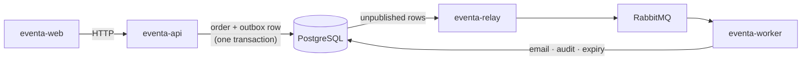

# Eventa

**Event registration & management for the Thai market.** Attendees discover events
and book tickets; organizers sell, check people in at the door, and get paid.

Multi-tenant, bilingual **EN/TH**, money in integer satang, **THB** with 7% VAT,
times **UTC on the wire and Asia/Bangkok on screen**. Card and **PromptPay**
payments through Stripe, under **PCI SAQ-A** — no card number ever reaches our
servers.

## Repositories

| Repository | What it is | Stack |
| --- | --- | --- |
| [**eventa-web**](https://github.com/kaungkhantdev/eventa-web) | Attendee portal, public event pages, organizer console | React 19 · Vite · Tailwind v4 |
| [**eventa-api**](https://github.com/kaungkhantdev/eventa-api) | All business rules. Owns the database schema and every migration | NestJS 11 · Drizzle · Postgres |
| [**eventa-relay**](https://github.com/kaungkhantdev/eventa-relay) | Publishes the transactional outbox to RabbitMQ | NestJS · amqplib |
| [**eventa-worker**](https://github.com/kaungkhantdev/eventa-worker) | Email, calendar sync, audit, scheduled domain jobs | NestJS · RabbitMQ · SMTP |
| [**eventa-docs**](https://github.com/kaungkhantdev/eventa-docs) | Requirements, architecture, data model, development guide | Markdown |
| [**eventa-ui-kit**](https://github.com/kaungkhantdev/eventa-ui-kit) | Static HTML/Tailwind kit — the visual source of truth | HTML · Tailwind (CDN) |
| [**eventa-infra**](https://github.com/kaungkhantdev/eventa-infra) | Terraform, Helm, Argo CD | Terraform · Helm |

## How the pieces fit



The API never talks to RabbitMQ, and the worker never talks to the API. They meet
through the database and the broker — so a domain change and the message
announcing it are written in **one transaction** and can never disagree.

📖 **[How the services connect](https://github.com/kaungkhantdev/eventa-docs/blob/main/04-architecture/how-services-connect.md)**
— the five-minute version, including what breaks when each service stops.

## Running it

```bash
docker compose up -d          # in eventa-api: postgres, rabbitmq, mailpit
cd eventa-api    && pnpm migrate && pnpm seed && pnpm dev
cd eventa-relay  && pnpm dev   # ← without this, no email is ever sent
cd eventa-worker && pnpm dev
cd eventa-web    && pnpm dev
```

## Where to start reading

- **New here?** [How the services connect](https://github.com/kaungkhantdev/eventa-docs/blob/main/04-architecture/how-services-connect.md)
- **Building a feature?** [Development guide](https://github.com/kaungkhantdev/eventa-docs/blob/main/05-development/development-guide.md)
- **Changing the schema?** [Entity catalog](https://github.com/kaungkhantdev/eventa-docs/blob/main/04-architecture/entities.md) — and it starts in `eventa-api`
- **Why is it built this way?** [Software architecture + ADRs](https://github.com/kaungkhantdev/eventa-docs/blob/main/04-architecture/software-architecture.md)

## House rules

Every repo carries the same non-negotiables in its `AGENTS.md`:

- **PCI SAQ-A** — no card field, ever. Stripe owns the PAN.
- **Money is integer satang** on the wire, formatted once at the edge. `null` is not `0`.
- **The API is the source of truth.** Never dual-write.
- **TDD** — no production rule without a test that required it.
- **Authorization is server-side.** Hiding a button is tidying, not a control.
